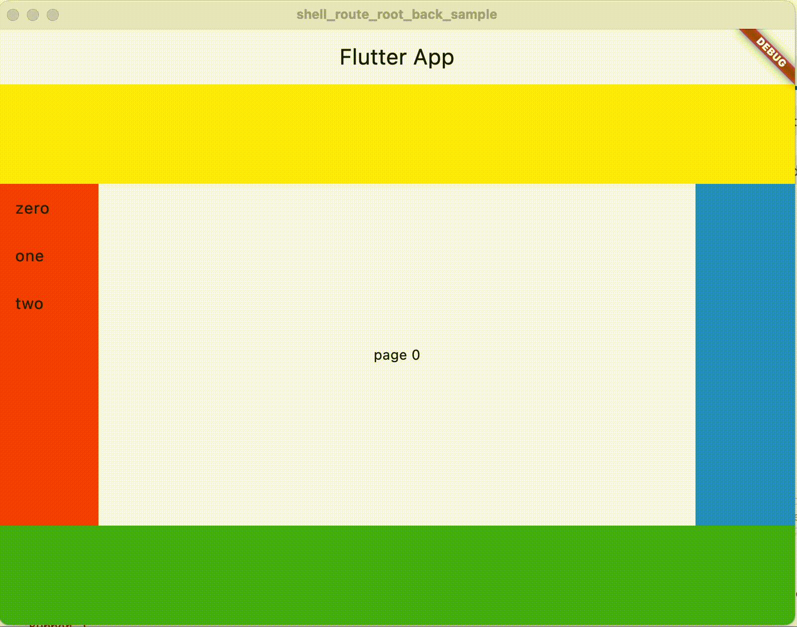

# shell_route_root_back_sample

Contrary to popular belief, the
[ShellRoute](https://pub.dev/documentation/go_router/latest/go_router/ShellRoute-class.html)
class of [the go_router package](https://pub.dev/packages/go_router) is not just
for [enabling the
BottomNavigationBar](https://medium.com/@ahm4d.bilal/using-gorouters-shellroute-in-flutter-for-nested-navigation-777a9a20642f),
although I admit that it's hard to find a sample that does anything else.

Here's a silly sample I built that builds panes all around the navigated pages
to illustrate what I mean:



To enable the back button on the top-level AppBar, I manually added the
BackButton to the AppBar for the ShellPage, which is the top-level widget
I defined to hold the top-level UI:

```dart
class ShellPage extends StatefulWidget {
  final Widget child;
  final ShellPageController controller;

  const ShellPage({super.key, required this.child, required this.controller});

  @override
  State<ShellPage> createState() => _ShellPageState();
}

class _ShellPageState extends State<ShellPage> {
  ...

  @override
  Widget build(BuildContext context) => Scaffold(
        appBar: AppBar(
          leading: widget.controller.canPop
              ? BackButton(onPressed: context.pop)
              : const SizedBox(),
          title: const Text(App.title),
        ),
        body: ... // colored panes and the ShellRoute child widget
      );
}
```

By default, the AppBar will look at Navigator.canPop and show the BackButton as
appropriate, but that doesn't work for us, since it looks at the top-level
Navigator and we want to look at the Navigator created by the ShellRoute. For
that to work, we need to reflect the state of the ShellRoute Navigator to the
top-level Navigator. To do that, I created a little ShellRouteController:

```dart
class ShellPageController extends ChangeNotifier {
  bool _canPop = false;
  bool get canPop => _canPop;

  void navChanged(bool canPop) {
    _canPop = canPop;
    notifyListeners();
  }
}
```

The controller just tracks canPop so that the ShellPage knows when to show the
BackButton. To know when navigation has changed, I need to hook this bad boy up
to an instance of the NavigatorObserver:

```dart
class ShellNavigatorObserver extends NavigatorObserver {
  final controller = ShellPageController();

  @override
  void didPop(Route route, Route? previousRoute) {
    super.didPop(route, previousRoute);
    _navChanged(route);
  }

  @override
  void didPush(Route route, Route? previousRoute) {
    super.didPush(route, previousRoute);
    _navChanged(route);
  }

  void _navChanged(Route route) =>
      controller.navChanged(route.navigator?.canPop() ?? false);
}
```

This guy watches for push and pop events from the app's GoRouter instance, then
uses those to cache the canPop state of the ShellRoute's Navigator.

Then I feed an instance of the ShellNavigatorObserver to the GoRouter, which is
how we hook up the whole chain:

```dart
class App extends StatelessWidget {
  static final _rootNavigatorKey = GlobalKey<NavigatorState>();
  static final _shellNavigatorKey = GlobalKey<NavigatorState>();
  static final _shellNavigatorObserver = ShellNavigatorObserver();

  final _router = GoRouter(
    navigatorKey: _rootNavigatorKey,
    routes: [
      ShellRoute(
          navigatorKey: _shellNavigatorKey,
          builder: (context, state, child) => ShellPage(
                controller: _shellNavigatorObserver.controller,
                child: child,
              ),
          observers: [
            _shellNavigatorObserver
          ],
          routes: [...]
      ),
    ],
  );

  ...
}
```

Now, when GoRouter does any pushing or popping, i.e. makes a change the back
stack, we reflect the current canPop state to the controller, which in turn
notifies the ShellPage to rebuild, which either shows or hides the BackButton as
appropriate.

All of that said, this feels like a hack. I'm sure there's a better way to do
this and I'm open to suggestions!